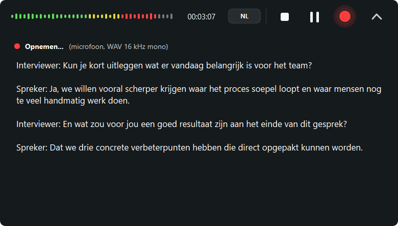

# AudioTranscriber

AudioTranscriber is a compact local desktop recorder and transcription strip for
interviews, notes, meetings, and conversations.

It records audio locally, transcribes locally with `faster-whisper`, and keeps a
small floating PySide6 strip on screen while you work.

## Privacy

AudioTranscriber is designed for sensitive conversations.

- Recordings are stored locally on your computer.
- Transcripts are stored locally on your computer.
- Whisper transcription runs locally through `faster-whisper`.
- Audio and transcript content are not sent to a cloud transcription service.
- Production builds only check GitHub Releases for app updates; this does not upload
  recordings or transcript text.
- Whisper model files may be downloaded on first use or after refreshing the local
  model cache.

## Screenshots

Collapsed recorder strip:


Expanded live captions:



## Features

- Compact floating recorder strip with dark rounded styling.
- Default collapsed state for low distraction during interviews.
- Quick expand/collapse animation for the live captions panel.
- Magnetic snap to the top screen edge, with release when pulled down.
- One primary record/status button:
  - red while idle or recording;
  - yellow while processing;
  - subtle pulsing during recording and processing.
- Stop and pause controls.
- Timer and lightweight waveform preview.
- Compact 7-bar waveform in collapsed mode.
- Reduced waveform amplitude in expanded mode to keep focus on the conversation.
- Local WAV recording at 16 kHz, mono, 16-bit PCM.
- Microphone recording through `sounddevice`.
- Right-click `Microphone input` menu with:
  - `Auto-detect`;
  - explicit input-device choices;
  - remembered device selection in user settings;
  - fallback to auto-detect when no device is selected.
- Settings and diagnostics screen with app paths, system information, microphone
  devices, selected input, and transcription model settings.
- Near-real-time transcript preview from completed recording chunks.
- Incremental `.txt` transcript saving next to the recorded WAV.
- Language selector on the strip: `AUTO`, `NL`, or `EN`.
- Language can be changed while recording; future chunks use the new setting.
- User-friendly local/system messages in the transcript panel:
  - live captions are shown in white;
  - system and error messages are shown more quietly in light grey.
- Post-processing for saved WAV files:
  - `WAV to MP3 Backup` creates `*.backup.mp3`;
  - `WAV to High Quality Transcript` creates `*.high-quality.txt`.
- GitHub Releases update check in production builds.
- Model cache refresh action for clearing local Whisper model files.

Development builds also expose test tools:

- Test tone input for machines without a microphone.
- Dev sample selection from `dev_samples/`.
- Dev sample playback.
- Dev sample recording input for end-to-end recording/transcription checks.

## Recording And Transcription

Recordings are saved as:

```text
WAV, 16 kHz, mono, 16-bit PCM
```

Live transcription defaults:

```text
model=base
device=cpu
compute_type=int8
cpu_threads=0
vad_filter=false
beam_size=1
live_chunk_seconds=4
language=auto | nl | en
output=*.txt
```

The live transcript is chunk-based. It is intended as a recent preview while
recording, not perfect live dictation. When recording stops, queued live chunks
are drained and saved. The normal recording flow does not start a second
transcription pass after stop.

High-quality transcription defaults:

```text
model=small
device=cpu
compute_type=int8
cpu_threads=physical-core formula, capped at 4
vad_filter=true
beam_size=1
chunk_seconds=15
output=*.high-quality.txt
```

The high-quality CPU thread formula uses physical cores:

```text
physical <= 2  -> use all physical cores
physical <= 4  -> keep 1 physical core free
physical > 4   -> cap at 4 threads
```

MP3 backup uses ffmpeg from the system `PATH` first, then falls back to
`imageio-ffmpeg` for packaged builds.

## Runtime Profiles

The app behavior is controlled by `AUDIOTRANSCRIBER_PROFILE`.

```text
AUDIOTRANSCRIBER_PROFILE=dev
```

Dev profile:

- Uses project-local `recordings/`.
- Uses project-local `.models/` for the faster-whisper cache.
- Shows input selector, test tone, and dev sample actions.
- Used by `run.ps1`, `dev.ps1`, and `run.bat`.

```text
AUDIOTRANSCRIBER_PROFILE=prod
```

Prod profile:

- Uses microphone recording only.
- Shows microphone device selection plus the settings and diagnostics screen.
- Hides test tone and dev sample actions.
- Stores recordings in `Documents/AudioTranscriber/Recordings`.
- Stores models in the OS app data folder.
- Downloads transcription models on first use.
- Checks GitHub Releases for updates.
- Used by frozen/package builds unless the environment variable overrides it.

Optional update repository override:

```text
AUDIOTRANSCRIBER_UPDATE_REPO=jwamsterdam/audiotranscriber
```

## Development Run

From the repository root:

```powershell
cd C:\Users\jwhen\Desktop\audiotranscriber
.\run.ps1
```

If PowerShell script execution gets in the way:

```powershell
.\run.bat
```

Both commands create `.venv` when needed, install the local package, set the dev
profile, and start the app.

For restart-on-save UI iteration:

```powershell
.\dev.ps1
```

This closes and restarts the app when files under `src/` change.

Manual setup:

```powershell
python -m venv .venv
.\.venv\Scripts\Activate.ps1
pip install -e .
python -m audiotranscriber.main
```

On macOS/Linux:

```bash
python3 -m venv .venv
source .venv/bin/activate
pip install -e .
python -m audiotranscriber.main
```

## Windows Build

Close any running `AudioTranscriber.exe` before building. Windows locks loaded
`.exe`, `.dll`, and `.pyd` files.

Create the production folder build:

```powershell
cd C:\Users\jwhen\Desktop\audiotranscriber
.\build-windows.ps1
```

Output:

```text
dist\AudioTranscriber\AudioTranscriber.exe
```

The build script:

- creates `.venv` when needed;
- installs the local package;
- installs PyInstaller;
- sets `AUDIOTRANSCRIBER_PROFILE=prod`;
- sets `TEMP` and `TMP` to `.tmp\build`;
- runs PyInstaller with `audiotranscriber.spec`.

Create the Windows installer:

```powershell
.\package-windows.ps1
```

Output:

```text
installer\AudioTranscriberSetup-v0.1.7.exe
```

`package-windows.ps1` runs the production folder build first, then uses Inno Setup
6 when it is installed. The installer is per-user and installs to:

```text
%LOCALAPPDATA%\Programs\AudioTranscriber
```

Create the portable Windows zip from the folder build:

```powershell
Compress-Archive -Path .\dist\AudioTranscriber\* -DestinationPath .\installer\AudioTranscriber-v0.1.7-windows.zip -Force
```

Check expected outputs:

```powershell
Get-Item .\dist\AudioTranscriber\AudioTranscriber.exe
Get-Item .\installer\AudioTranscriberSetup-v0.1.7.exe
Get-Item .\installer\AudioTranscriber-v0.1.7-windows.zip
```

## Release Checklist

Update version references before a release:

- `pyproject.toml`
- `src/audiotranscriber/app_config.py`
- `installer-windows.iss`
- `package-windows.ps1`
- `README.md`
- `CHANGELOG.md`

Validate:

```powershell
.\.venv\Scripts\python.exe -m compileall src\audiotranscriber
git diff --check
.\build-windows.ps1
.\package-windows.ps1
Compress-Archive -Path .\dist\AudioTranscriber\* -DestinationPath .\installer\AudioTranscriber-v0.1.7-windows.zip -Force
```

Commit and tag:

```powershell
git status --short
git add CHANGELOG.md README.md AGENTS.md docs\screenshots pyproject.toml installer-windows.iss package-windows.ps1 src\audiotranscriber
git commit -m "Prepare v0.1.7 high-quality transcription release"
git tag -a v0.1.7 -m "AudioTranscriber v0.1.7"
git push origin main
git push origin v0.1.7
```

Publish a GitHub Release with:

- `installer\AudioTranscriberSetup-v0.1.7.exe`
- `installer\AudioTranscriber-v0.1.7-windows.zip`

## Local Files

These local/generated paths should not be committed:

- `recordings/`
- `dev_samples/`
- `.models/`
- `.tmp/`
- build outputs under `build/`, `dist/`, and `installer/`
